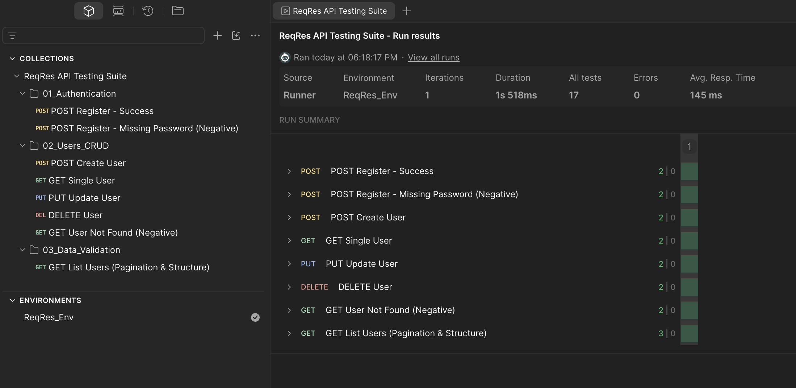

# ReqRes API Test Suite (Postman)

Automated and manual test suite for the [ReqRes.in](https://reqres.in/) REST API built with **Postman**.

## Test Results


## Features & Coverage
* **Auth:** Registration flow (positive `200` & negative `400`).
* **CRUD Operations:** Complete User lifecycle (`POST 201`, `GET 200`, `PUT 200`, `DELETE 204`, `404 Not Found`).
* **Data Validation:** Pagination and JSON schema/type checks.
* **Chaining:** Dynamic extraction of `token` and `user_id` into environment variables.
* **Assertions:** Status codes, response times (<500ms), headers, and body structures.

## How to Run

### Via Postman GUI:
1. Import `ReqRes_Collection.postman_collection.json` and `ReqRes_Environment.postman_environment.json`.
2. Select the **ReqRes_Env** environment.
3. Open **Collection Runner** and run the collection.

### Via Newman (CLI):
```bash
npm install -g newman
newman run ReqRes_Collection.postman_collection.json -e ReqRes_Environment.postman_environment.json